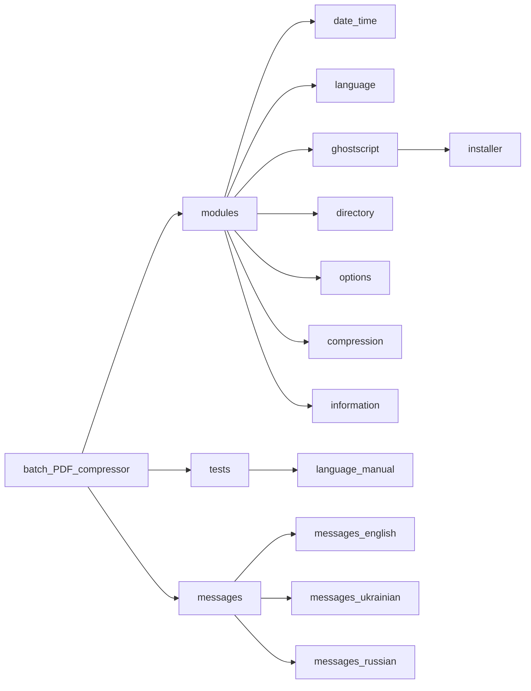

#  [Batch PDF compressor](https://github.com/sergeiown/batch_PDF_compressor/releases)

- [Structure](#structure)
- [Requirements](#requirements)
- [Script Functionality](#script-functionality)
- [Usage](#usage)
- [License](#license)

| This   Windows batch processing script provides an efficient way to compress PDF files using different compression levels and options. It utilizes the [Ghostscript](https://www.ghostscript.com/) to perform operations on PDF files. The main purpose is to conveniently batch compress all PDF files in the selected directory as well as in all subdirectories. |                                              |
| :--- | ---: |

## Structure

## Requirements

1. **Windows operating system.\***
   
2. **[Ghostscript](https://www.ghostscript.com/).\*\***

| \* \- *Tested on Windows 10 and Windows 11 operating systems, both x86 and x64 architectures. The scripts have not been tested on earlier versions.* |                                              |
| :--- | :---: |

| \* \- *If [Ghostscript](https://www.ghostscript.com/) is not installed, the latest release will be detected and offered to install when Batch PDF Compressor is launched.* |                                              |
| :--- | :---: |

### Script Functionality

The script offers the following features:

1. Automatic selection of English, Ukrainian, or Russian according to the system language using universal UTF-8 (support for external message files has been added).
2. Selection the path to the directory with PDF files to be compressed using the windows.Forms.FolderBrowserDialog. With path validation and allowance for 3 false addresses or bounces.
3. Selection of compression level: low, medium, high, ultra.
4. Choose to delete or save original PDF files.
5. The script processes all PDF files within the specified directory and its subdirectories.
6. Displays progress of file processing and compression.
7. Upon completion, provides an overview of script execution, including the number of processed files, sizes before and after compression, and the compression ratio.
8. Additionally, the script checks the system for the presence of Ghostscript before execution and maintains a detailed log file for each compression operation.

|  |  |
| :---: | :---: |

### Usage

1. **[Use the executable installer](https://github.com/sergeiown/batch_PDF_compressor/releases)** *(best practice)* or clone the project and run the `batch_PDF_compressor.bat` script *(If you are using a batch script, make sure that the text files with messages are available in the `/messages` directory and the modules are available in the `/modules` directory)*.
2. The required language will be selected automatically according to the system settings.
3. Select the directory containing the PDF files you want to compress. The script will "look" at the lower levels and process the PDFs in the subdirectories on its own.
4. Select the compression level (1-4) corresponding to the provided options.
5. Choose whether to delete or keep the original PDF files.
6. After completion you can find the a log file containing information about processed files and compression results at `%UserProfile%\Documents` with the name `batch_PDF_compressor.log`.

### License

[Copyright (c) 2023 - 2024 Serhii I. Myshko](https://github.com/sergeiown/compress_PDF/blob/main/LICENSE.md)
